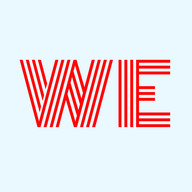

# WE — мы вдвоём  

**Приложение для пар и семей: списки задач, вишлист, планирование поездок и покупок**

<p align="center">
  
</p>

---

**WE** (читается как «Мы») — уютное PWA-приложение для двоих, которое легко растёт до целой семьи. Здесь можно вести общие списки дел, собирать вишлисты, планировать поездки и совместные покупки. Приложение работает офлайн, устанавливается на главный экран и всегда под рукой.

> 🚀 **Готовый сервис доступен по адресу:** [https://we.hanriel.ru](https://we.hanriel.ru)  
> Зарегистрируйтесь, создайте свою семью и приглашайте близких — это бесплатно!

---

## ✨ Возможности

- **👨‍👩‍👧‍👦 Семьи и совместный доступ**  
  Вы можете создать «семью» и добавить в неё своих партнёров, детей или друзей.  
  Все списки и заметки автоматически становятся общими для членов семьи.

- **🛒 Список покупок**  
  Добавляйте товары, отмечайте купленное, фильтруйте по категориям и статусу.  
  Удобно для походов в магазин и планирования запасов.

- **🎁 Список желаний**  
  Собирайте идеи подарков, добавляйте ссылки, цены и приоритеты.  
  Больше никаких «а что тебе подарить?» — всё уже в списке.

- **📅 Планирование поездок**  
  Укажите даты, бюджет, составьте чек-лист вещей.  
  Всё, что нужно для совместного отпуска или выходных.

- **⏰ Напоминания**  
  Личные и общие напоминания с повторениями — не пропустите важные даты и события.

- **🔄 Привычки**  
  Трекер привычек: отмечайте ежедневные действия, следите за прогрессом вместе.

- **🔐 Безопасный вход**  
  Используйте **Passkey (WebAuthn)** — вход по Face ID, Touch ID или PIN-коду.  
  Можно зарегистрировать несколько устройств (телефон, планшет, ноутбук).

- **📱 PWA-приложение**  
  Установите на главный экран смартфона — работает как нативное приложение, даже без интернета.

---

## 🛠 Технологии, на которых построен сервис

- **Next.js 16** (App Router, React Server Components)
- **TypeScript**
- **Tailwind CSS** + **shadcn/ui**
- **MariaDB** (хранилище данных)
- **Prisma** (ORM)
- **Auth.js** (аутентификация: Passkey, Email)
- **PWA** (Service Worker через Serwist)
- **Nginx** + **PM2** (хостинг)

---

## 🧑‍💻 Для разработчиков

Исходный код **WE** открыт — мы приглашаем вас к изучению, обсуждению и доработкам.  
Если вы хотите предложить новую функцию, исправить ошибку или просто разобраться, как устроено приложение, — добро пожаловать!

### 📥 Установка для разработки

1. Клонируйте репозиторий:

   ```bash
   git clone https://github.com/ваш-аккаунт/we-app.git
   cd we-app
   ```

2. Установите зависимости:

    ```bash
    npm install
    ```

3. Создайте файл .env.local и настройте подключение к локальной MariaDB (см. пример).

4. Выполните миграции:

    ```bash
    npx prisma migrate dev --name init
    ```

5. Запустите в режиме разработки:

    ```bash
    npm run dev
    ```

Подробная документация по сборке и деплою доступна в CONTRIBUTING.md (скоро).

## 🤝 Как помочь проекту

- Сообщайте об ошибках через Issues.
- Предлагайте идеи и улучшения.

- Присылайте Pull Requests с новыми функциями или исправлениями.

Пожалуйста, ознакомьтесь с нашим кодексом поведения перед началом работы.

## ⚖️ Лицензия и условия использования

Исходный код WE распространяется под лицензией MIT — это означает, что вы можете:

- Свободно изучать, изменять и распространять код.
- Использовать его в своих некоммерческих и коммерческих проектах.

Однако, мы просим вас уважать наш труд и не использовать код для создания публичного сервиса, который является полной копией WE, без нашего явного разрешения.
Официальный сервис предоставляется только по адресу <https://we.hanriel.ru>. Если вы хотите запустить свой независимый экземпляр для личных или внутренних целей, свяжитесь с нами — мы обсудим это.

Мы открыты к сотрудничеству и всегда рады новым участникам, которые хотят развивать проект вместе с нами, а не создавать «клоны».

## ✍️ Авторы

Hanriel — основатель, разработчик, дизайнер.

[GitHub](https://github.com/hanriel) · [Telegram](https://t.me/Hanriel)

## 🌟 Благодарности

Вдохновение и инструменты:

- [Next.js](https://nextjs.org/)
- [Auth.js](https://authjs.dev/)
- [Prisma](https://prisma.io/)
- [shadcn/ui](https://ui.shadcn.com/)
- [Serwist](https://serwist.pages.dev/)

---

**Создавайте общее будущее с WE — вместе проще, веселее и надёжнее! 💙**
